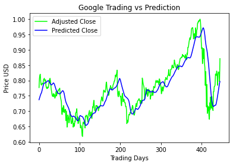

# Stock Price Prediction using LSTM

## Project Overview

Investment firms, hedge funds and even individuals have been using financial models to better understand market behavior and make profitable investments and trades. A wealth of information is available in the form of historical stock prices and company performance data, suitable for machine learning algorithms to process.

Can we actually predict stock prices with machine learning? Investors make educated guesses by analyzing data. They'll read the news, study the company history, industry trends and other lots of data points that go into making a prediction. The prevailing theories is that stock prices are totally random and unpredictable but that raises the question why top firms like Morgan Stanley and Citigroup hire quantitative analysts to build predictive models. In fact about 70% of all orders on Wall Street are now placed by software, we're now living in the age of the algorithm.

This project utilizes Deep Learning models, Long-Short Term Memory (LSTM) Neural Network algorithm, to predict stock prices. For data with timeframes recurrent neural networks (RNNs) come in handy but recent researches have shown that LSTM, networks are the most popular and useful variants of RNNs. 

I have used Keras to build a LSTM to predict stock prices using historical closing price and trading volume and visualize both the predicted price values over time and the optimal parameters for the model.

## Problem Highlights
*The challenge of this project is to accurately predict the future closing value of a given stock across a given period of time in the future.  For this project I have used a Long Short Term Memory networks – usually just called “LSTMs” to predict the closing price of the S&P 500 using a dataset of past prices*

* **Achievements:**
  * Built a model to accurately predict the future closing price of a given stock, using Long Short Term Memory Neural net algorithm. 
  * Achieved Mean Squared Error rating of just 0.00212520 after training the model for 20 epochs with a batch size of 64.

Things I have learnt by completing this project:
* How to apply deep learning techniques: Long Short Term Memory Neural Network algorithms.
* How to use keras-tensorflow library.
* How to collect and preprocess given data.
* How to analyze model's performance.
* How to optimise Long Short Term Memory Neural Network algortithm, to ensure increase in postive results.

## Software and Libraries
This project uses the following software and Python libraries:

* [Python 3](https://www.python.org/downloads/release/python-395/)
* [NumPy](http://www.numpy.org/)
* [Pandas](http://pandas.pydata.org/)
* [Keras](https://keras.io/)
* [Tensorflow](https://www.tensorflow.org)
* [Jupyter Notebook](http://ipython.org/notebook.html)
* [Yahoo Finance](https://pypi.org/project/yfinance/)
